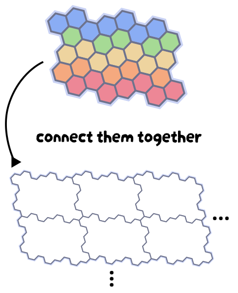

<h1 align="center">
  
</h1>

**Miso** is a modular, isomorphic musical keyboard designed to make exploring alternative tuning systems and microtonality more accessible.

It’s an open-source hardware project built around small, repeatable units: each Miso block is a 31-key keyboard that can stand alone or connect with others to form a larger instrument.

  

## Why Miso?

Traditional keyboards are great, but a very awkward and limiting interface for those interested in exploring other tuning systems. High quality alternatives exist, but they command an equally high price. Miso lowers that barrier by offering a flexible, extensible platform for experimentation.

## Features

### Modular design

Each Miso unit is a self-contained block. Connect multiple blocks together to scale up your instrument. This allows for a low initial investment in something that can be expanded gradually over time.

### Isomorphic layout

Miso isn't just for microtonal music—isomorphic layouts are useful even in 12-tone equal temperament!

### Velocity sensitive

Uses the same low-cost, widely available Hall effect key switches found in modern gaming keyboards. Hot-swappable so you can try different switches or easily replace any that become defective.

### MIDI controller

Plug into your compuler via USB-C and play with your favourite software instruments.

### Fully open-source

PCB designs, 3D-printable case, and keycaps are all available—build it yourself or modify it to suit your needs.

### Community-driven

No single point of failure. Contributions, forks, and experiments are all encouraged.

## License

[MIT](LICENSE) © 2026
