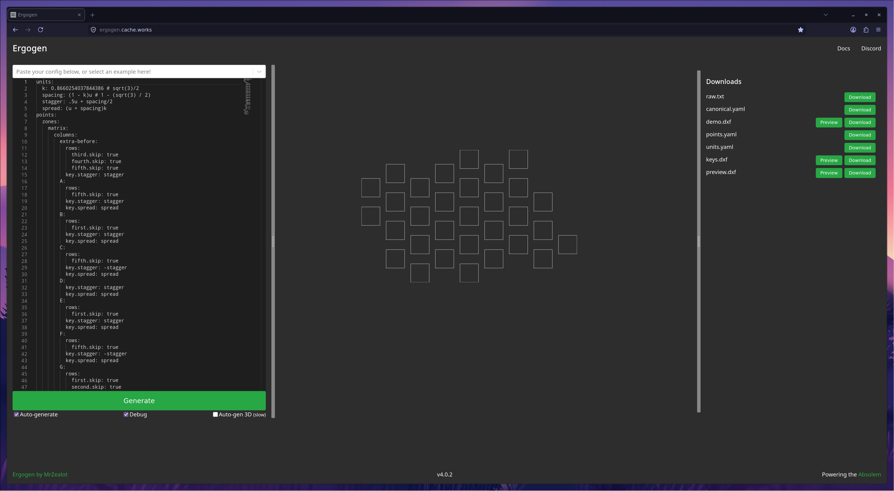

# What's "Ergogen"?

[Ergogen](https://ergogen.xyz) is a software for parametrically specifying designs for computer keyboards (the non-musical, type-y kind). It can be used to design layouts for keyswitches, and even PCBs and cases. Since Miso uses regular Hall effect keyswitches, ergogen allows us to control the core of the design from a single YAML file. This also means if you want to tweak Miso's key size / spacing, `keyboard.yaml` will be the first file you'll want to edit.

If you need to tinker with `keyboard.yaml`, here's a couple of links that will help:

- [Ergogen live web editor](https://ergogen.cache.works/)

This editor makes working with Ergogen much easier, as you can get instand feedback and autocompletion suggestions when typing.

- [https://docs.ergogen.xyz/](Official Ergogen documentation)
